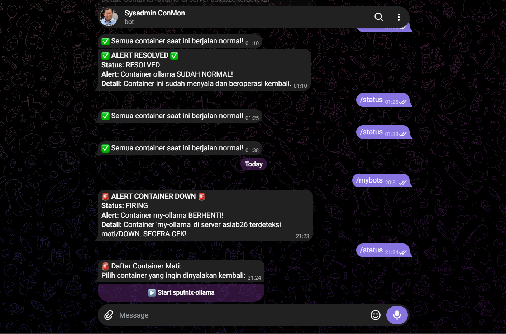

# 🐳 Docker Monitoring & Active Recovery Bot (`BotCon`)

<p align="center">
  <b>Docker Monitoring atau BotCon: Sistem automasi untuk memantau dan memulihkan container server menggunakan Bot Telegram</b>
</p>

---

## 📌 Ringkasan Proyek

**BotCon** adalah sistem automation berbasis bot telegram untuk memantau kondisi container yang berjalan di server  secara *real-time* dan sistem pemulihan (*active recovery*) container Docker. Melalui integrasi **Telegram Bot**, *system administrator* dapat menerima notifikasi insiden (*alerting*) saat container berhenti (*down*) dan menyalakannya kembali secara instan **hanya dengan satu kali klik** tanpa perlu melakukan koneksi SSH ke server.

---

## 📸 Demo & Tampilan Bot



> **Alur Kerja Interaktif:**
> 1. **Alerting**: Alertmanager mengirimkan pesan peringatan saat ada container terdeteksi mati (*FIRING*).
> 2. **Status Check**: Perintah `/status` menampilkan daftar container yang berstatus *exited*[cite: 1].
> 3. **Instant Recovery**: Klik tombol **`▶️ Start <container-name>`** untuk menyalakan kembali container secara langsung melalui Docker API[cite: 1].

---

## ✨ Fitur Utama

- 🚨 **Automated Incident Alerting**: Pengiriman notifikasi otomatis via Telegram saat terjadi kegagalan/container mati berbasis aturan Prometheus & Alertmanager[cite: 1].
- 🔄 **One-Tap Active Recovery**: Tombol *Inline Keyboard* interaktif di Telegram untuk memulihkan container tanpa terminal[cite: 1].
- 📊 **Resource & Metric Collection**: Monitoring penggunaan CPU, RAM, Network, dan Disk I/O container secara presisi menggunakan **cAdvisor**.
- 🔒 **Role-Based Access Control (RBAC)**: Otentikasi obrolan terisolasi berbasis `ALLOWED_CHAT_ID` untuk mencegah eksekusi perintah dari pihak tak berwenang.
- 🔑 **Secure Environment Handling**: Pengelolaan token sensitif dan konfigurasi terisolasi menggunakan file `.env` (bebas dari *hardcoded credentials*).

---

## 🏗️ Arsitektur Monitoring Stack

```text
┌─────────────────────────┐
│    cAdvisor Container   │ ─── (Collects Container Metrics)
└────────────┬────────────┘
             │
             ▼
┌─────────────────────────┐
│   Prometheus Monitoring │ ─── (Evaluates Alert Rules)
└────────────┬────────────┘
             │
             ▼
┌─────────────────────────┐       ┌─────────────────────────┐
│   Alertmanager Service  │ ────► │       Telegram UI       │
└─────────────────────────┘       └────────────┬────────────┘
                                               │
                                  (Executes /status & Start)
                                               │
                                               ▼
┌─────────────────────────┐       ┌─────────────────────────┐
│    Docker Unix Socket   │ ◄──── │   BotCon (Python Bot)   │
└─────────────────────────┘       └─────────────────────────┘
